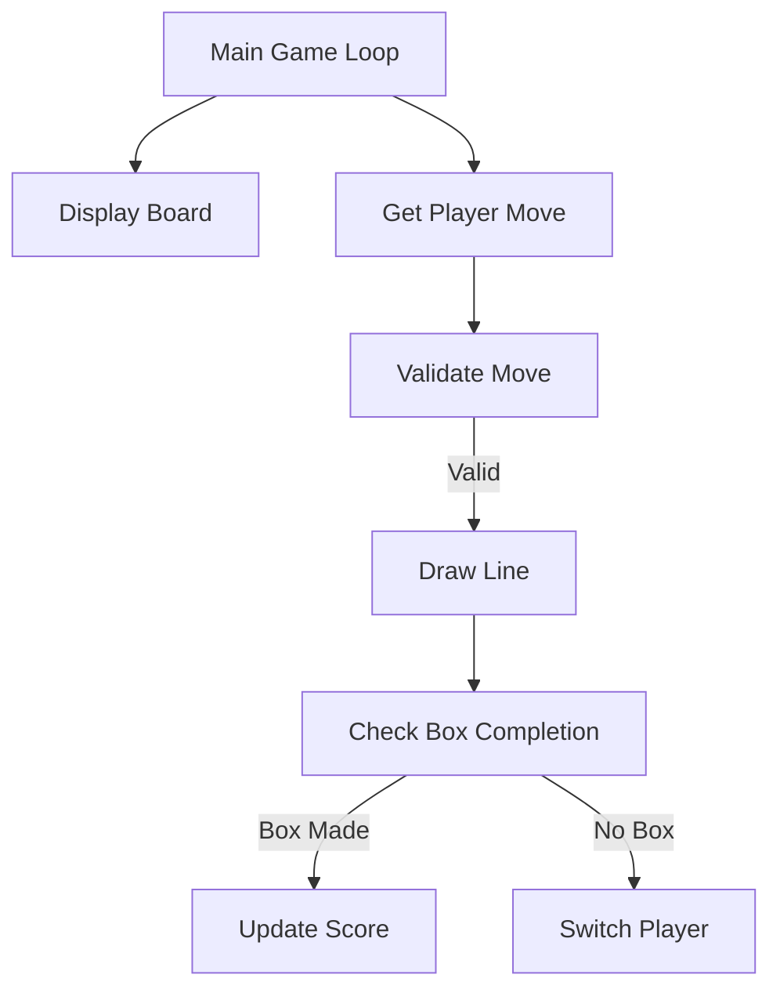

# 🎮 Dots and Boxes - Assembly Edition
*A classic strategy game built in x86 Assembly with Irvine32*

## 🌟 Key Features
- **Color-coded** game board (Red vs Blue)
- **Turn-based** two-player system
- **Real-time score tracking**
- **Input validation** for all moves
- **Automatic box completion** detection
- **Win condition** checking

## Built With
 MASM Assembler

 Irvine32 Library

 Visual Studio

## 🏗️ Code Architecture

 
      <strong>EL2003 - Computer Organziation and Assembly Language</strong>   <em>FAST NUCES, 2025</em> 

 
